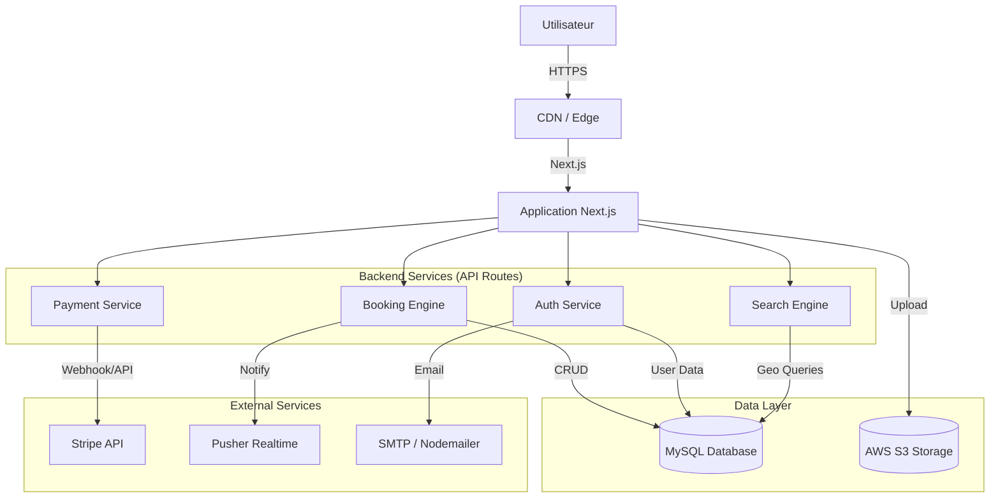

# 🏠 Will-Back - Plateforme de Réservation de Logements

> **Documentation Technique & Commerciale**  
> *Version du document : 1.0.0*  

---

## 📑 Table des Matières

1. [Vue d'Ensemble & Vision du Projet](#-vue-densemble--vision-du-projet)
2. [Plan Commercial & Business Model](#-plan-commercial--business-model)
3. [Architecture Technique](#-architecture-technique)
4. [Fonctionnalités Détaillées](#-fonctionnalités-détaillées)
5. [Sécurité & Robustesse](#-sécurité--robustesse)
6. [Roadmap & Évolutivité](#-roadmap--évolutivité)
7. [Structure du Projet](#-structure-du-projet)
8. [Guide de Démarrage](#-guide-de-démarrage)

---

## 🔭 Vue d'Ensemble & Vision du Projet

**Will-Back** est une solution complète de plateforme de location de logements entre particuliers, conçue pour rivaliser avec les leaders du marché grâce à une architecture moderne, performante et une expérience utilisateur soignée. 

Le projet se distingue par une approche **"Host-Centric"** et **"Guest-Friendly"**, offrant des outils avancés de gestion pour les propriétaires et une interface fluide et sécurisée pour les voyageurs.

### Objectifs Clés
- **Expérience Utilisateur Premium** : UI/UX réactive, cartes interactives, recherche instantanée.
- **Sécurité Maximale** : Vérification d'identité, paiements sécurisés via Stripe, double authentification (2FA).
- **Scalabilité** : Architecture conçue pour supporter une charge croissante d'utilisateurs et de listings.

---

## 💼 Plan Commercial & Business Model

Cette section détaille la stratégie commerciale et les leviers de monétisation intégrés à la plateforme.

### 💰 Modèle de Revenus (Revenue Streams)
Le modèle économique repose principalement sur un système de commissions transactionnelles, automatisé via l'intégration **Stripe Connect**.

1.  **Frais de Service Voyageur (Guest Service Fee)** :
    -   Pourcentage (ex: 10-14%) ajouté au montant de la réservation payé par le voyageur.
    -   Couvre les frais de plateforme, le support et la maintenance.
2.  **Frais de Service Hôte (Host Service Fee)** :
    -   Pourcentage (ex: 3%) déduit du versement à l'hôte.
    -   Couvre les frais de traitement des paiements.
3.  **Options Premium (Futur)** :
    -   Mise en avant des annonces ("Featured Listings").
    -   Badge "Certifié" pour les logements vérifiés.

### 🎯 Cible (Target Audience)
-   **Les Hôtes (Supply)** : Propriétaires immobiliers cherchant une alternative flexible, avec des outils de gestion de calendrier (iCal) et de prix saisonniers avancés.
    -   *Avantage Will-Back* : Tableau de bord analytique, gestion fine des prix, virements automatisés.
-   **Les Voyageurs (Demand)** : Touristes et professionnels en déplacement cherchant des logements authentiques.
    -   *Avantage Will-Back* : Recherche géolocalisée précise, avis vérifiés, sécurité des paiements.

---

## 🏗 Architecture Technique

Le projet repose sur une "Modern Data Stack" assurant performance, typage fort et maintenabilité.

### 🛠 Stack Technologique

| Couche | Technologie | Justification |
| :--- | :--- | :--- |
| **Frontend** | **Next.js 16** (React) | Rendu hybride (SSR/CSR), SEO optimisé, Routing performant. |
| **Langage** | **TypeScript** | Sécurité du typage, maintenabilité du code à grande échelle. |
| **Styling** | **TailwindCSS** | Développement rapide, design responsive et cohérent. |
| **Base de Données** | **MySQL** (via **Prisma**) | Données relationnelles structurées, ORM puissant pour les migrations. |
| **Authentification** | **NextAuth.js** + **JWT** | Gestion sécurisée des sessions, providers multiples (Email, Google, etc.). |
| **Paiement** | **Stripe Connect** | Gestion complexe des flux financiers (split payments, payouts). |
| **Maps** | **Leaflet** / **GeoJSON** | Cartographie interactive open-source et performante. |
| **Realtime** | **Pusher** | Notifications instantanées et messagerie en temps réel. |
| **Stockage** | **AWS S3** | Stockage scalable et sécurisé des photos des logements. |

### 📐 Diagramme d'Architecture (Simplifié)



---

## 🚀 Fonctionnalités Détaillées

### 1. Gestion des Utilisateurs & Authentification
-   **Inscription/Connexion** : Email/Password, hashage sécurisé via `bcryptjs`.
-   **Sécurité Renforcée** : Double Authentification (2FA) via OTP (`speakeasy`, `qrcode`).
-   **Vérification** : Email de confirmation, Reset de mot de passe sécurisé.
-   **Rôles** : Système RBAC (Guest, Host, Admin).

### 2. Gestion des Annonces (Listings)
-   **CRUD Complet** : Création multi-étapes, modification, suppression.
-   **Géolocalisation** : Coordonnées (Lat/Lng), sélection sur carte, ville.
-   **Médias** : Upload de photos multiples sur AWS S3.
-   **Tarification Avancée** :
    -   Prix de base.
    -   **Prix Saisonniers** : Définition de périodes spécifiques (Haute saison, Événements) avec prix personnalisés.
    -   Réductions longue durée (Semaine/Mois).
-   **Calendrier** :
    -   Synchronisation **iCal** (Import/Export) pour éviter les double-réservations avec d'autres plateformes (Airbnb, Booking).
    -   Blocage manuel de dates.

### 3. Moteur de Recherche & Réservation
-   **Recherche Géographique** : Recherche par Ville, Dates et Nombre de voyageurs.
-   **Filtres** : Prix, Équipements, Type de logement.
-   **Réservation** :
    -   Flux de paiement sécurisé.
    -   Calcul automatique des totaux (Nuits + Frais de ménage + Frais de service).
    -   Statuts de réservation (Confirmé, Annulé, En attente de paiement).

### 4. Paiements (Fintech)
-   **Intégration Stripe** :
    -   *Payment Intents* pour sécuriser les fonds lors de la réservation.
    -   *Webhooks* pour gérer les succès/échecs de paiement de manière asynchrone.
-   **Payouts Hôtes** : Système de reversement automatique aux hôtes après le check-in (séquestre des fonds).

### 5. Communication & Communauté
-   **Messagerie Interne** : Chat en temps réel entre Hôte et Voyageur (Supporté par Pusher).
-   **Avis & Notations** : Système de reviews après séjour, calcul de la moyenne.
-   **Favoris** : Liste de souhaits (Wishlist) pour les utilisateurs.

### 6. Administration & Modération
-   **Certification** : Workflow de validation des logements (demande, review par admin, approbation).
-   **Sécurité** : Logs des événements de sécurité (IP, User Agent, tentatives suspectes).
-   **Bannissement** : Possibilité de bannir des utilisateurs ou désactiver des annonces.

---

## 🔒 Sécurité & Robustesse

La plateforme intègre des pratiques de sécurité de niveau industriel :

-   **Protection CSRF** : Tokens anti-CSRF sur les mutations de données.
-   **Rate Limiting** : Protection contre les attaques par force brute et DDoS (module `rateLimit.ts`).
-   **Sanitization** : Nettoyage des entrées utilisateurs pour prévenir les injections XSS et SQL.
-   **Validation Zod** : Validation stricte des schémas de données entrant et sortant.
-   **Audit Logs** : Traçabilité complète des actions sensibles (Table `SecurityEvent`).

---

## 🗺 Roadmap & Évolutivité

### Ce qui est prêt (Current State)
- [x] Authentification complète & 2FA.
- [x] Création et gestion des listings avec photos S3.
- [x] Recherche et Cartographie.
- [x] Système de réservation et paiement Stripe de base.
- [x] Messagerie temps réel.

### Plans Futurs (Q2-Q4 2026)
1.  **Mobile App (React Native)** : Portage de l'expérience sur iOS et Android en réutilisant l'API existante.
2.  **IA & Recommandations** : Moteur de recommandation de logements basé sur l'historique de recherche et les favoris.
3.  **Support Multi-Devises** : Extension du module `ExchangeRate` pour supporter USD, GBP, etc. en plus de l'EUR.
4.  **Dashboard Analytics Hôte** : Graphiques avancés des revenus et taux d'occupation.
5.  **Programme de Fidélité** : Points et récompenses pour les "Super Guests".

---

## 📂 Structure du Projet

```bash
will-back/
├── prisma/                 # Schéma de base de données et seeds
├── public/                 # Assets statiques
├── src/
│   ├── components/         # Composants React réutilisables (Design System)
│   ├── hooks/              # Hooks React personnalisés
│   ├── lib/                # Logique métier et singletons (Stripe, S3, Pusher)
│   ├── pages/              # Routes de l'application (Pages Router)
│   │   ├── api/            # API Endpoints (Backend)
│   ├── server/             # Configuration serveur (DB connection)
│   ├── styles/             # Styles globaux
│   ├── types/              # Définitions TypeScript partagées
│   └── utils/              # Fonctions utilitaires
├── middleware.ts           # Middleware Next.js (Auth, redirects)
└── package.json            # Dépendances et scripts
```
